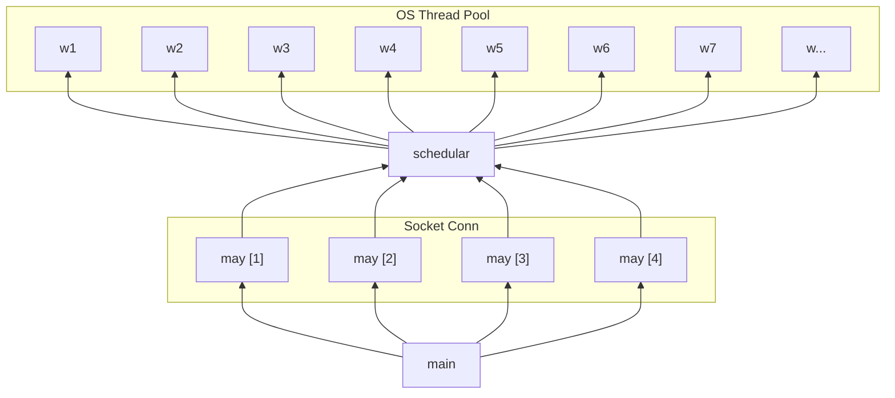

# µHTTP 🦀🚀🌎

A tiny, fast, library for writing HTTP servers in Rust designed for humans:

- **Simple:** Inspired by Go's standard HTTP server library - using non-async handlers to support blocking calls and simple type signatures.

- **Fast:** High performance, multi-threaded implementation that competes with the fastest Rust HTTP servers.

- **Flexible**: Simple interface that enables many use cases. It can be used directly or to act as a base for frameworks to build on top of. The `Request` and `Response` types implement Rust's `Read` and `Write` interfaces, allowing for a standardized and generic interaction.

## Usage

```rust
use std::io;
use std::io::Write;

use uhttp::http1::Server;
use uhttp::Request;
use uhttp::Response;

fn main() -> io::Result<()> {
  Server::new(handler).listen("0.0.0.0:8080")
}

fn handler(req: Request, mut res: Response) -> io::Result<()> {
  res.write_all(b"Hello World!")
  res.write_header(200)
}
```

## Installation

Available on [crates.io](https://crates.io/crates/uhttp), install with:

```shell
cargo add uhttp
```

```toml
[dependencies]
uhttp = "0.*"
```

## Philosophy

The project was born out of a desire to have an http server library for Rust that is pleasant to use, minimal and extensible. 

Most other libraries use async Rust which does help with IO heavy workloads but can be difficult to work with. Additionally, many of the existing libraries make simple tasks, like passing dependencies into handlers or returning streamed responses, quite challenging - and in some cases, are simply incomplete.

µHTTP aims to offer a time-tested interface for writing http servers that is simple, extensible and performant.

It features sensible defaults for flushing responses, detecting content types, and automatic frame encodings.

Using the standard library `Read` and `Write` traits for reading and writing to http requests to maximize compatibility and provide familiarity.

## Examples

### Request Body

```rust
use std::io;
use std::io::Write;

use uhttp::http1::Server;
use uhttp::Request;
use uhttp::Response;
use uhttp::utils::body;

fn main() -> io::Result<()> {
  Server::new(handler).listen("0.0.0.0:8080")
}

fn handler(mut req: Request, mut res: Response) -> io::Result<()> {
  // Utility to read incoming bytes
  let body_text = body::utf8(&mut req.body)?;
  println!("{}", body_text);

  res.write_header(201)
}
```

### Routing

The URL is passed into the handler as a `String` and can be used to match request paths to routes. You can use simple if statements or a third party URL matching library to handle routing.

TODO: Adding a basic router

```rust
use std::io;
use std::io::Write;

use uhttp::http1::Server;
use uhttp::Request;
use uhttp::Response;
use uhttp::utils::body;

fn main() -> io::Result<()> {
  Server::new(handler).listen("0.0.0.0:8080")
}

fn handler(mut req: Request, mut res: Response) -> io::Result<()> {
  if req.method == "GET" && req.url == "/" {
    return res.write_all("Hello World!")
  }

  if req.method == "POST" && req.url == "/api/echo" {
    let bytes = body::bytes(&mut req.body)?;
    return res.write_all(bytes)
  }

  res.write_header(404)
}
```

### Serving a File

```rust
use std::io;
use std::io::Write;
use std::fs;

use uhttp::http1::Server;
use uhttp::Request;
use uhttp::Response;

fn main() -> io::Result<()> {
  http1::Server::new(handler).listen("0.0.0.0:8080")
}

fn handler(req: Request, mut res: Response) -> io::Result<()> {
  let bytes = fs::read("/path/to/index.html")?;
  res.write_all(bytes)
  res.write_header(200)
}
```

### Constants

Provided are some constants to make responses more consistent

```rust
use std::io;
use std::io::Write;

use uhttp::http1::Server;
use uhttp::Request;
use uhttp::Response;
use uhttp::c;

fn main() -> io::Result<()> {
  Server::new(handler).listen("0.0.0.0:8080")
}

fn handler(req: Request, mut res: Response) -> io::Result<()> {
  res.headers().set(c::headers::CONTENT_TYPE, c::content_type::TEXT_PLAIN);
  res.write_all(b"Hello World!")
  res.write_header(c::status::OK)
}
```

### Benchmarks

Benchmarks running on my computer (Fedora Linux, AMD 7950x with 100gb RAM) with 100 concurrent connections


I have excluded incomplete Rust HTTP server implementations, you can find more examples under [benchmarks]('https://github.com/alshdavid/uhttp/tree/main/benchmarks')

### Explaining Performance

#### Setting Headers Explicitly

Setting the `Content-Type`, `Content-Length` or `Transfer-Encoding` explicitly will improve performance as the server does not need to detect them automatically.

#### Thread Pool & May

uhttp has two layers, an IO layer that uses the [May](https://github.com/Xudong-Huang/may) coroutine library to accept incoming TCP sockets in a non-blocking fashion which forwards the requests to an OS thread-pool for processing



It might be jarring to see so many OS threads being spawned however, in 2024, the overhead for OS threads is significantly lower than it has been historically and applications today can use thousands of OS threads with little impact on performance.

While I'd love to use async Rust, I find its usage to be un-ergonomic - for this reason uhttp spawns a large thread-pool at start up and schedules the processing of each http request on its own dedicated OS thread from the thread pool.

This affects start-up time slightly but does not have any meaningful runtime overhead.

### TODO

- Provide compressor utils for `Content-Encoding`: `gzip` and `br`
- `Transfer-Encoding: chunked`
- [Server Sent Events](https://developer.mozilla.org/en-US/docs/Web/API/Server-sent_events/Using_server-sent_events) (use this instead of WebSocket)
- HTTP/2
- More performance improvements

### Out of Scope

Though feel free to raise a PR to add support

- WebSocket